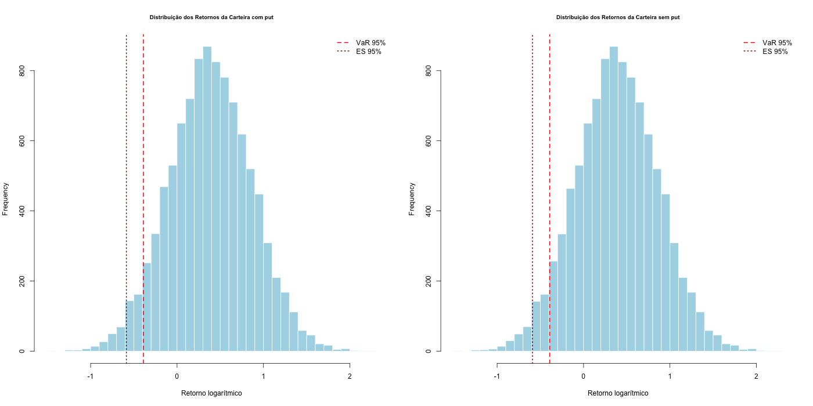
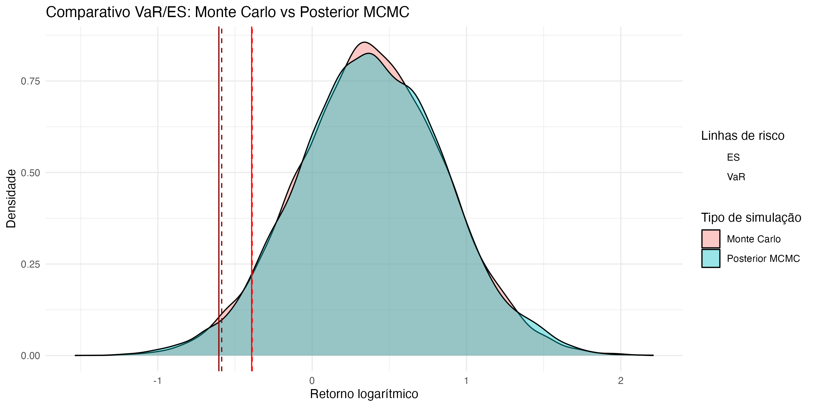

# Risk Analysis with Monte Carlo & Bayesian Inference (MCMC)

This project estimates the risk of an investment portfolio composed of **100 shares** and a **European put option** used as a hedge.  
The analysis is performed in **R** using **Monte Carlo simulation** (GBM) and risk metrics such as **Value-at-Risk (VaR)** and **Expected Shortfall (ES)**.  
An optional extension includes **Bayesian parameter estimation** using **Metropolis–Hastings (MCMC)**.

## Problem
Markets are volatile and portfolio losses can be severe. This project answers:
- How does the portfolio behave under simulated market scenarios?
- What are the portfolio risk levels (VaR and ES at 95%)?
- How does parameter uncertainty affect risk estimates? (MCMC extension)

## Method
- **Geometric Brownian Motion (GBM)** to simulate terminal stock prices
- **Monte Carlo (N = 10,000)** simulations
- **European put pricing** via discounted payoff
- **Risk metrics:** VaR(95%) and ES(95%)
- *(Optional)* **MCMC (Metropolis–Hastings)** to infer μ and σ

## Repository structure
- `src/` — R code (simulation + risk metrics)
- `docs/` — original academic report (PDF) and HTML export
- `results/` — figures generated by the code

## How to run
1. Open the repository folder in RStudio
2. Run:
   ```r
   source("src/monte_carlo_mcmc.R")

## Example Outputs

### GBM simulated path


### Returns distribution (with hedge vs without hedge)


### Monte Carlo vs Posterior MCMC comparison


